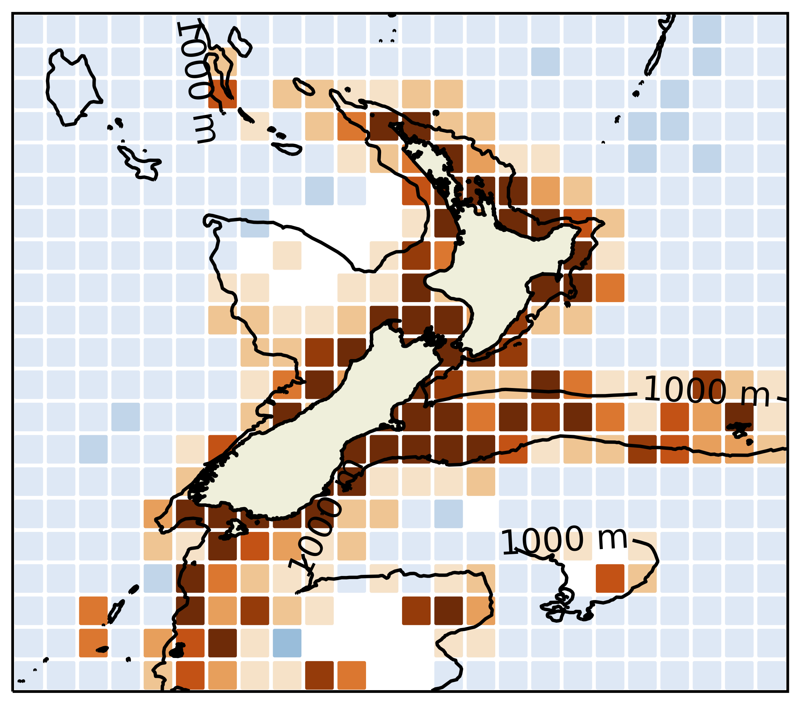

<a id="page-top"></a>

<!-- PROJECT LOGO -->
<br />
<div align="center">
  <a href="https://github.com/metocean/moana-qc">
    
  </a>

<h3 align="center">Moana TD Sensor Quality Control and Processing</h3>

  <p align="center">
    This library contains code to perform the operational, near real-time quality-control and processing of <a href="https://www.moanaproject.org/temperature-sensors">Mangōpare/Moana oceanographic observation data</a>, initially deveoped as part of the <a href="https://www.moanaproject.org/">Moana Project</a> with technology partner <a href="https://www.zebra-tech.co.nz/moana/">ZebraTech</a>.
    <br />
    <br />
    <a href="https://github.com/metocean/moana-qc/blob/master/docs/"><strong>Documentation »</strong></a>
    <br />
  </p>
</div>

<p align="center">
  
  
  
  
  <a href="https://zenodo.org/badge/latestdoi/295919031"></a>
</p>

<!-- TABLE OF CONTENTS -->
<details>
  <summary>Table of Contents</summary>
  <ol>
    <li>
      <a href="#about-the-programme">About The Programme</a>
      <ul>
        <li><a href="#quality-control-and-processing">Quality Control and Processing</a></li>
        <li><a href="#code-structure">Code Structure</a></li>
        <li><a href="#publically-available-files">Publically Available Files</a></li>
      </ul>
    </li>
    <li><a href="#installation">Installation</a></li>
    <li><a href="#contributing">Contributing</a></li>
    <li><a href="#references">References</a></li>
    <li><a href="#licensing">Licensing</a></li>
    <li><a href="#attribution_statement">Attribution Statement</a></li>
    <li><a href="#community">Community</a></li>
  </ol>
</details>
<br />


# About The Programme
This library contains code intended for the operational, near real-time quality-control of [Mangōpare/Moana oceanographic observation data](https://www.zebra-tech.co.nz/moana/).  Only automatic quality control is included at this time, for use with measurements transmitted in near real-time.  For more information on the [Moana Project](https://www.moanaproject.org/temperature-sensors)'s Mangōpare sensor programme, see [Jakoboski et. al (2024)](https://doi.org/10.1016/j.pocean.2024.103278), contact info@moanaproject.org, or visit the websites above.

The current versions are for the purpose of quality-controlling data from the Moana Project's Mangopare (Te Tiro Moana) Mangōpare/Moana temperature and pressure sensor, but will be made more generic if needed.

<p align="right">(<a href="#page-top">back to top</a>)</p>

## Quality Control and Processing

Standard in-situ oceagraphic measurement quality control tests are applied to Mangōpare/Moana observations.  Please see the [docs](https://github.com/metocean/moana-qc/blob/master/docs/) for details on [quality control tests](https://github.com/metocean/moana-qc/blob/master/docs/moana_sensor_qc.md) and [data processing](https://github.com/metocean/moana-qc/blob/master/docs/sensor_processing.md).

<p align="right">(<a href="#page-top">back to top</a>)</p>

## Code Structure

- wrapper.py is the highest level class, which coordinates all the others.  Within it, the user specifies the data reader, the metadata reader, a preprocessor, and the qc_class.
- Data reader: reads the observations in each sensor offload file, formats variable names, and loads global attributes from the file header.
- Metadata reader: right now, reads a spreadsheet with fisher metadata, including whether the sensor is stationary or mobile.
- Preprocessor: very Mangopare specific, mostly does position processing.  Also adds variable attributes from attribute file specified in wrapper.py and finds the "bottom" data points for fishing data.
- QC class: specifies the class that actually applies the QC tests after reading and preprocessing the data.

Defaults for the above are included in wrapper.py in case none are specified.

Currently, the data and metadata readers are both classes in readers.py.

"Standard" oceanographic QC tests for temperature and pressure data are included in qc_tests_df.py.  Most of these are based on QARTOD or Argo tests.  If any new tests are needed, that is most likely the best place to put them.  For each test, a quality flag is assigned.  The tests from qc_test_df.py that should be included in a quality-control run are specified in warpper.py under the variable name `test_list`.  This variable is passed to apply_qc.py where each test is run.  See qc_tests_df.py documentation for lists of possible test names.  Some tests generally work well, others currently not at all.  This is indicated in the qc_tests_df.py docstring.

<p align="right">(<a href="#page-top">back to top</a>)</p>

## Publically Available Files

(Mangōpare Specific)
Two columns have been added to the Mangōpare metadata (Public, Publication Date). The first column "Public" especifies if the data is available for the Public or not (boolean, True or False). If True, the second column "Publication Date" especifies the date when the sharing data agreement was signed.   

A new code has been developed to adapt and transfer the data into our THREDDS server (see ops_qc/publish.py).

Relevant files are located in the THREDDS folder. 
- THREDDS/attribute_list.yml : All the information related to the variables, coordinates, dimensions and global attributes. 
- THREDDS/transfer.public.mangopare.yml : Config file to use for operational deployment.

If you use the publically available data, please cite the Zenodo reference for the dataset: [](https://doi.org/10.5281/zenodo.10420342)

<p align="right">(<a href="#page-top">back to top</a>)</p>

# Installation

This repository contains code to run the `ops-qc` ("operational" or automatic quality control) python package. Two installation options are available: from source or docker image:    

## Option 1 | Via pip

```shell
python -m pip install 'git+https://github.com/metocean/moana-qc'
```

## Option 2 | Buliding a docker image

The following assumes [`docker`](https://www.docker.com/) is installed.

The metocean/moana-qc repository contains a default (external) [`Dockerfile`](https://github.com/metocean/moana-qc/blob/master/Dockerfile) and an internal operational [`Dockerfile_MOS`](https://github.com/metocean/moana-qc/blob/master/Dockerfile_MOS).  To build a new image, external users want to use the default `Dockerfile` (which is independent of MetOcean's internal libraries).  For MetOcean operational internal use, please build from `Dockerfile_MOS`.

To build the external use Dockerfile version (outside of Metservice/MetOcean ops system), from the moana-qc directory, use something like: 
```shell
docker build -f Dockerfile -t moana-qc .
```

The metocean/moana-qc/Dockerfile docker image requires some libraries in private git repositories, but are needed for the current operational version at MetOcean.  They are accessed via a github token.  To run from a computer with the github token under variable GIT_TOKEN, build the docker image via

```shell
docker build -f Dockerfile_MOS --no-cache --build-arg GIT_TOKEN=${GIT_TOKEN} -t metocean/moana-qc:latest .
```

Then run the docker image via

for default use:
```shell
docker run -ti -v /source:/source -v /data:/data moana-qc:latest
```

or for MetOcean internal use:
```shell
docker run -ti -v /source:/source -v /data:/data metocean/moana-qc:latest`
```

`/data` is a directory where the sensor data can be found and also where the output directory will be.  If you need the docker container to access another directory, add it with the -v tag.

<p align="right">(<a href="#page-top">back to top</a>)</p>

# Contributing

Any contributions are very welcome!  

The master branch is currently intended for MetOcean operational use.  The external-aus branch is intended for development by the IMOS Fish-SOOP programme.

To contribute, please fork the repo and create a pull request, or open an issue with an appropriate tag.

1. Fork the Project
2. Create a new Feature Branch (`git checkout -b feature/YourNewFeature`)
3. Commit your Changes (`git commit -m 'Descriptive Comment'`)
4. Push to the Branch (`git push origin feature/YourNewFeature`)
5. Open a Pull Request

<p align="right">(<a href="#page-top">back to top</a>)</p>

# References

For more an in-depth description of the Mangōpare sensor programme:

Julie Jakoboski, Moninya Roughan, John Radford, João Marcos Azevedo Correia de Souza, Malene Felsing, Robert Smith, Naomi Puketapu-Waite, Mireya Montaño Orozco, Kimberley H. Maxwell, Cooper Van Vranken,
Partnering with the commercial fishing sector and Aotearoa New Zealand’s ocean community to develop a nationwide subsurface temperature monitoring program, Progress in Oceanography, 2024, 103278, [https://doi.org/10.1016/j.pocean.2024.103278](https://doi.org/10.1016/j.pocean.2024.103278).

For a description of the cross-disciplinary context of the Moana Project:

Souza JMAC, Felsing M, Jakoboski J, Gardner JPA and Hudson M (2023) Moana Project: lessons learned from a national scale transdisciplinary research project. Front. Mar. Sci. 10:1322194. doi: [10.3389/fmars.2023.1322194](https://www.frontiersin.org/articles/10.3389/fmars.2023.1322194/full)

<p align="right">(<a href="#page-top">back to top</a>)</p>

# Licensing

Please see [LICENSE.md](https://github.com/metocean/moana-qc/blob/master/LICENSE.md) for the license under which this code can be shared.  Please consider contributing to the code under this repository whenever possible rather then forking or cloning into a new repository so all can benefit from collaborative work.  If you need to fork/clone into a new repository, please let us know so we can include any new developments as a community.

<p align="right">(<a href="#page-top">back to top</a>)</p>

# Attribution Statement

Original code base by MetOcean Solutions, a Division of Meteorological Service of New Zealand Ltd, developed as part of the Moana Project. The Moana Project is funded by the New Zealand Ministry of Business, Innovation, and Employment (MBIE) Endeavour Fund.

The Mangōpare sensor and deck unit hardware were developed by Zebra-Tech, Ltd, Nelson, New Zealand as part of the Moana Project.  Sensors are available through [ZebraTech](https://www.zebra-tech.co.nz/).

<p align="right">(<a href="#page-top">back to top</a>)</p>

# Community

A fishing vessel, in-situ ocean observing quality control working group is in development through [FVON](https://fvon.org/).  Please contact either the Moana Project (info@moanaproject.org) or FVON (through their website) for more information.

<p align="right">(<a href="#page-top">back to top</a>)</p>


